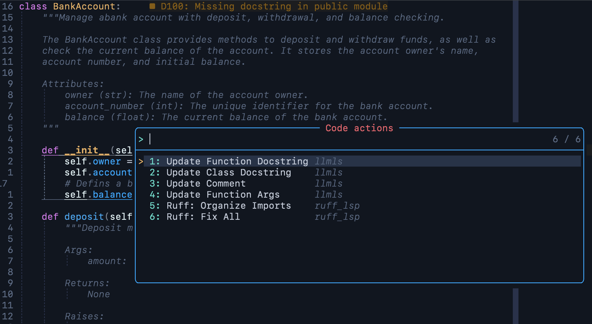

# Polyglot-LS

Polyglot-LS is a single-binary language server that uses the tree-sitter
parser to provide context-aware code actions. These code actions are performed
by a Large Language Model (LLM) by forming a prompt which interpolated a given
text with tree-sitter nodes content.



## Setup

### Prerequisites

- **Rust**: Ensure you have Rust installed. If not, install it from [the
  official Rust website](https://www.rust-lang.org/tools/install).
- **AWS Profile**: Create an AWS profile named `my-aws-bedrock` to get the
  correct credentials for using the Bedrock
  `anthropic.claude-3-haiku-20240307-v1:0` model.

### Compilation

To compile the project, follow these steps:

1. Clone the repository:

   ```sh
   git clone https://github.com/patwie/polyglot_ls.git
   cd polyglot_ls
   ```

2. Build the project:

   ```sh
   cargo build --release
   ```

3. The binary will be located in `target/release/polyglot_ls`.

### Using the Language Server

1. Copy the contents of the `code_actions` configs directory to
   `$HOME/.config/polyglot_ls/code_actions/`.

2. To run the server, execute:

   ```sh
   ./target/release/polyglot_ls
   ```

   For debugging, use:

   ```sh
   ./target/release/polyglot_ls --listen
   ```

   For direct usage in Neovim, use:

   ```sh
   ./target/release/polyglot_ls --stdin
   ```

## Limitations

The following are not hard limitations, but rather practical choices:

- This project only supports the AWS Bedrock model (no ChatGPT, no Ollama).
- Many settings are hard-coded (e.g., the used model).
- Only example code actions are implemented for Python and Rust.
- During compilation, Clippy will report some warnings in your terminal. This
  is a work-in-progress Proof of Concept.
- The name of this project may change in the future.

## Integration

For Neovim and the "neovim/nvim-lspconfig" plugin, use the following setup:

```lua
local configs = require 'lspconfig.configs'

if not configs.polyglot_ls then
    configs.polyglot_ls = {
      default_config = {
        cmd = { "/path/to/polyglot_ls" , "--stdin" },
        -- for debugging, launch "polyglot_ls" with --listen and use:
        -- cmd = vim.lsp.rpc.connect('127.0.0.1', 9257),
        filetypes = { 'python', 'rust' },
        single_file_support = true,
      },
    }
end
```

## Configuration Tutorial

Each behavior is configured in YAML. Let's start by adding a function to place
a docstring to a Python function. Instead of:

```python
def add(a, b):
    return a + b
```

We want the output:

```python
def add(a, b):
    """Add two numbers.

    Args:
        a (int or float): The first number to add.
        b (int or float): The second number to add.

    Returns:
        int or float: The sum of a and b.

    Examples:
        >>> add(2, 3)
        5
        >>> add(2.5, 3.2)
        5.7
    """
    return a + b
```

To add such functionality, we first need to specify the trigger. Open the
[Tree-sitter Playground](https://tree-sitter.github.io/tree-sitter/playground)
and place the code above. According to the playground, this code action should
be enabled whenever the cursor is within a `function_definition` node.

```yaml
triggers:
  - kind: function_definition
    relation: findup
```

This will start in the current node under the cursor and traverse the AST up
until the first `function_definition` node. If no such node is found, the
action will be disabled.

To form a prompt, we also want to inform the LLM about some _context_ for the
action. In this case, we use the entire function (we could also use the entire
source code via `kind=module`).

```yaml
context:
  kind: function_definition
  relation: findup # findup | exact
  hints:
    - name: FUNCTION_CONTEXT
      query: ((function_definition) @function)
```

This is the start node to extract hints, like parameters, function body, and so
on, which can be interpolated into the prompt. In our case, we use the entire
function as a query. Those query results will interpolated into the the
prompt-template as a hint:

```yaml
prompt_template: |
  Do this or that for <<<FUNCTION_CONTEXT>>>
```

The answer from the LLM might need some post-processing (e.g., adding
brackets), which can be configured via an optional `answer_template`:

```yaml
answer_template: "{<<ANSWER>>>}"
```

The last piece is to tell the front-end where the answer should be placed. This
is a list of possible tree-sitter queries, which are walked in order, and
the first captured match will determine the target range. For Python functions,
we first want to try replacing the existing docstring. If this is not possible,
we will add a new docstring (before the function body).

```yaml
placement_strategies:
  # Try to find the docstring node
  - query: |
      (function_definition
        body: (block
          (expression_statement
            (string) @docstring)))
    position: replace_block
  # If not existent, find the body node and place it before
  - query: |
      (function_definition
        body: (block) @body)
    position: before
```

See the `config/code_actions/` directory for more examples.
