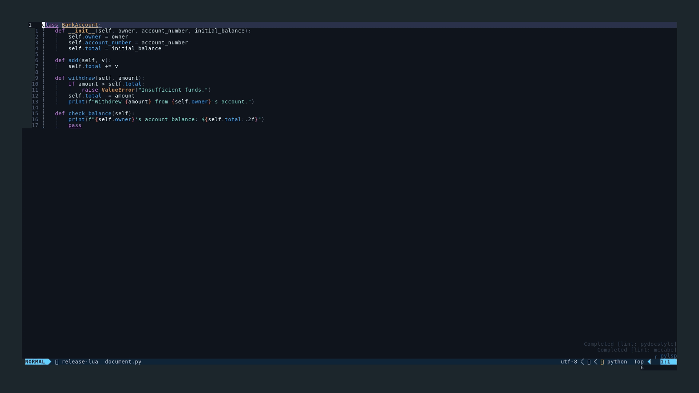
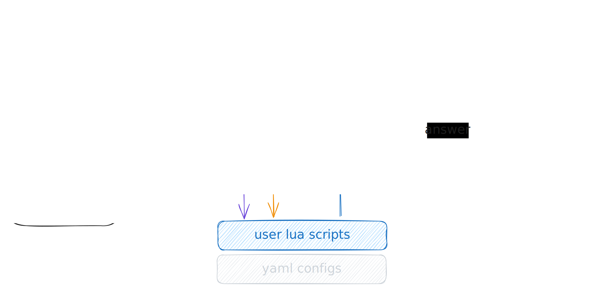

# Polyglot-LS

The only sane way to integrate Large Language Models (LLMs) into *any* editor
that supports the Language Server Protocol (LSP) is through a language server.



Polyglot-LS is a language server written in Rust that embeds Lua scripting,
which is responsible for creating prompts, post-processing LLM answers, and
determining where to place the LLM output. It has access to the Tree-Sitter
Abstract Syntax Tree (AST) and can walk nodes, form Tree-sitter queries.



## Usecases

To emphasize that point, using Lua scripting allows you to access any
information from the current file in a structured way, and you are free to
construct any string that will be used as a prompt for the language model. Here
are some use cases from my perspective:

### Add Documentation

Adding or updating docstrings to existing function implementations for various
languages. This will not only provide context but also determine where to place
these docstrings, allowing you to replace the documentation without touching
the code.

### Adjust function signatures

Using tree-sitter, a code-action can extract context (function source, nearest
class source, any TreeSitter node) to form prompts that can target other
TreeSitter nodes, like parameter lists of functions, which should be
substituted with LLM outputs.

### Chat locally

Engage in conversations with large language models (LLMs) by using Markdown
files. When you select your prompt, all the previous text will be used as
context, and the model's response will be output below, potentially overriding
everything below, similar to how web-based user interfaces (UIs) work when
editing prompts.

Or ask in any file via a prompt.


**For Neovim users:**, you can combine this with fuzzy-finding of all `.md`
files in a specific directory:

```lua
vim.keymap.set("n", "<leader>cn", function()
  builtin.find_files({
    prompt_title = "< Chats >",
    cwd = "$HOME/.chats/",
  })
end)
```

This, combined with [undotree](https://github.com/mbbill/undotree), provides a
powerful history feature and quick access to different chats.


### Fix typos

While you have access to tree-sitter information, you can use ranges to fix the
wording of selected text. This includes git commit messages when using your
editor to write them.


See [configs](./config/code_actions/) for examples.

## Setup

### Prerequisites

- **Rust**: Ensure you have Rust installed. If not, install it from [the
  official Rust website](https://www.rust-lang.org/tools/install).
- **AWS Profile**: Create an AWS profile named `my-aws-bedrock` to get the
  correct credentials for using the Bedrock
  `anthropic.claude-3-haiku-20240307-v1:0` model.

### Compilation

To compile the project, follow these steps:

1. Clone the repository:

   ```sh
   git clone https://github.com/patwie/polyglot_ls.git
   cd polyglot_ls
   ```

2. Build the project:

   ```sh
   cargo build --release
   ```

3. The binary will be located in `target/release/polyglot_ls`.

### Using the Language Server

1. Copy the contents of the `code_actions` configs directory to
   `$HOME/.config/polyglot_ls/code_actions/`.

2. To run the server, execute:

   ```sh
   ./target/release/polyglot_ls
   ```

   For debugging, use:

   ```sh
   ./target/release/polyglot_ls --listen
   ```

   For direct usage in Neovim, use:

   ```sh
   ./target/release/polyglot_ls --stdin
   ```

## Limitations

The following are not hard limitations, but rather practical choices:

- This project only supports the AWS Bedrock model (no ChatGPT, no Ollama).
- Many settings are hard-coded (e.g., the used model).

## Integration

For Neovim and the "neovim/nvim-lspconfig" plugin, use the following setup:

```lua
local configs = require 'lspconfig.configs'

if not configs.polyglot_ls then
    configs.polyglot_ls = {
      default_config = {
        cmd = { "/path/to/polyglot_ls" , "--stdin" },
        -- for debugging, launch "polyglot_ls" with --listen and use:
        -- cmd = vim.lsp.rpc.connect('127.0.0.1', 9257),
        filetypes = { 'python', 'rust', 'text', 'go', 'gitcommit', 'markdown' },
        single_file_support = true,
      },
    }
end
```

## Configuration Tutorial

See the [Tutorial.md](./TUTORIAL.md).
